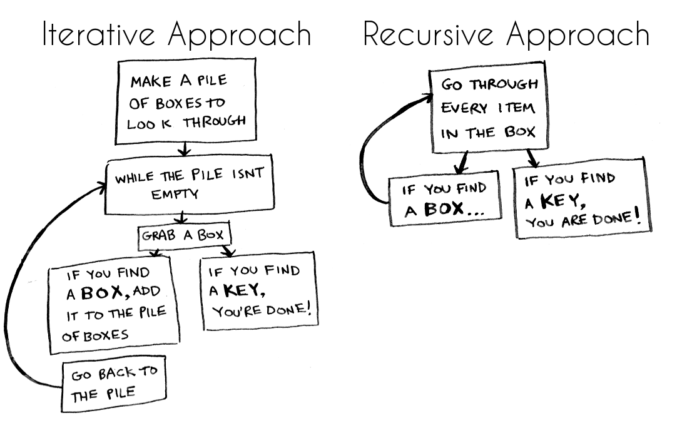

## Table of Content
1. [Recap Functions](#recap-functions)
1. [Prelude to Recursive](#prelude-to-recursive)
1. [Recursive How to](#recursive-how-to)
    - [Base Case (Limit)](#base-case-limit)
1. [Why Recursive](#why-recursive)
1. [References](#references)

## Recap Functions
Mari kita belajar ulang tentang function terlebih dahulu yah sebelum masuk ke materi utama kita !

fungsi atau `function` adalah salah satu cara di dalam dunia pemrograman untuk mengorganisir atau
memodularkan kode yang dapat digunakan berulang-ulang yang umumnya berisi kode yang menjalankan 
suatu aksi.

Dalam bahasa pemrograman lainnya ini disebut juga dengan `procedure` atau `subroutine`.

Nah di dalam javascript ini cara penggunaan fungsi adalah sebagai berikut:

### Deklarasi (Declare)
Diingat yah, bahwa dalam programming itu pasti ada IPO (Input Process Output) nya,
begitu juga dengan fungsi ini, yaitu:
- Input --> adalah Parameter di dalam fungsinya
- Process -> Logic / blok kode di dalam fungsinya
- Output -> hasil kembalian data / nilai yang akan dikembalikannya.

Misalnya sekarang kita ingin membuat suatu fungsi yang akan digunakan untuk mencetak angka dari
input yang diberikan sampai dengan angka `satu`.

```
input: 
5

output: 
5 
4 
3 
2 
1
```

Maka cara kita membuatnya adalah sebagai berikut:

```javascript
// File: 01-function.js
function printNumber(inputNumber) {
  for(let i = inputNumber; i >= 1; i--) {
    console.log(i);
  }
}
```

### Panggil (Call / Invoke)
Cara kita memanggil fungsi tersebut adalah sebagai berikut

```javascript
printNumber(5);
```

## Prelude to Recursive
Lalu apa hubungannya *nih* dengan materi yang akan kita pelajari hari ini? si fungsi dengan si 
rekursif ini?

Nah karena pengertian sederhana dari rekursif adalah:
```
Sebuah fungsi yang memanggil dirinya sendiri
```

Jadi ibaratnya *nih*, kalau di dalam representasi penggunaan fungsi adalah seperti ini:

```
input --> <fungsi> --> output
```

Maka kalau di dalam rekursif, representasinya adalah seperti ini:

```
input --> <fungsi, fungsi, fungsi, sampai puas> (*fungsiception*) --> output
```

## Recursive How To
Nah sekarang kita akan coba untuk membuat sebuah fungsi rekursif yang sangat sederhana yah,
ingat rekursif adalah sebuah fungsi yang akan memanggil dirinya sendiri !

Jadi kita akan membuat sebuah fungsi yang akan memanggil diri sendiri seperti ini:

```javascript
// file: 02-simplerecursive.js
function testRecursive() {
  testRecursive();
}

testRecursive();
```

Lalu kemudian kita akan jalankan kode berikut yah, sehingga yang akan terjadi adalaah...

```
node 02-simplerecursive.js 
02-simplerecursive.js:2
  testRecursive();
  ^

RangeError: Maximum call stack size exceeded
    at testRecursive (02-simplerecursive.js:2:3)
    at testRecursive (02-simplerecursive.js:2:3)
    at testRecursive (02-simplerecursive.js:2:3)
    at testRecursive (02-simplerecursive.js:2:3)
    at testRecursive (02-simplerecursive.js:2:3)
    ...
```

Nah loh, mengapa hal ini terjadi?

Ini terjadi karena kita belum begitu mengerti struktur yang dibutuhkan dalam sebuah fungsi rekursif
yah !

### Base Case (Limit)
Dikarenakan rekursif akan memanggil dirinya sendiri **TANPA BATAS**, maka kita harus membuat sebuah
kondisi yang memberhentikan rekursif itu sendiri, supaya dapat me-*limit* rekursifnya dan bisa
dihentikan.

Istilahnya adalah `base case` nya, berupa **HASIL KEMBALIAN** (return) terdasar dari sebuah
rekursif itu sendiri, sehingga membuat rekursif itu menjadi memiliki batas (`finite`)

Contoh misalnya kita kan membuat fungsi untuk mencetak angka dari input yang diberikan sampai 
dengan 1 dengan asumsi semua input adalah angka positif.

Maka cara kita membuat fungsinya adalah:

```javascript
// file: 03-recursive.js
function printNumberRecursive(number) {
  // base case
  if(number === 0) {
    return;
  }
  // logic
  console.log(number);

  // recursive
  printNumberRecursive(number-1);
}

printNumberRecursive(5);
```

Nah dari kode rekursif di atas ini, sudah memenuhi syarat karena sudah memiliki base case, logic,
dan pemanggil fungsi sendirinya itu, sehingga ketika terpanggil maka akan menghasilkan output yang
diinginkan tanpa terjadi `Maximum call stack size exceeded`.

Mari kita coba melihat dari yang standard looping dengan rekursifnya yah

<table>
<tr>
  <th>Standard Looping</th>
</tr>
<tr>
  <td>

  ```javascript
  function printNumber(inputNumber) {
    for(let i = inputNumber; i >= 1; i--) {
      console.log(i);
    }
  }

  printNumber(5);
  ```

  </td>
</tr>
<tr>
  <th>Recursive</th>
</tr>
<tr>
  <td>

  ```javascript
  function printNumberRecursive(number) {
    // base case
    if(number === 0) {
      return;
    }
    // logic
    console.log(number);

    // recursive
    printNumberRecursive(number-1);
  }

  printNumberRecursive(5);
  ```

  </td>
</tr>
</table>

Tapi dari sini penjelasan tentang rekursifnya masih terasa kurang bukan? Mari kita mencoba lagi
yah untuk membuat sebuah fungsi rekursif, misalnya kita ingin membuat sebuah fungsi faktorial 
dengan rekursif yah.

Faktorial adalah sebuah perhitungan matematika yang akan mengalikan sebuah angka dengan angka 
sebelumnya terus terusan hingga pada akhirnya akan dikalikan dengan 1.

Misal 5 Faktorial adalah 5 x 4 x 3 x 2 x 1

Nah sekarang kita akan coba untuk membuat fungsi untuk menghitung faktorial ini, tentunya dengan
rekursif yah !

```
input:
5
output:
120
```

```javascript
// file: 04-factorial.js
function factorial(inputNumber) {
  // base case
  // input number berkurang terus sampai dengan ... 1 bukan maka?
  if(inputNumber === 0) {
    return 1;
  }

  // perhitungannya sekaligus rekursifnya
  return inputNumber * factorial(inputNumber - 1);
}

console.log(factorial(5));
```

Perhatikan yah pada saat membuat ini base casenya pada saat angka 0 maka akan mengembalikan `1`
bukan `0` ataupun `kosong`, hal ini dikarenakan pada saat kita return angkanya akan ikut dikalikan
sehingga kalau dikalikan dengan `0` akan menjadi nol !

Loh kok jadinya begini? Bagaimana ini penjabarannya? Kenapa bisa berbeda dari yang atas?

Kita akan coba untuk mensimulasikan kode ini yah !

```
factorial(5)

5 * factorial(4)
      4 * factorial(3)
            3 * factorial(2)
                  2 * factorial(1)
                        1 * factorial(0)
                            1
                        1 * 1
                  2 *   1
            3 *   2
      4 *   6
5 *   24

120
```

Sampai di sini apakah masih kurang jelas?

Kalau sudah jelas mari kita coba *perbingungkan* lagi yah ^_^

Ternyata di dalam sebuah fungsi rekursif ini juga memanggil fungsi rekursifnya ini lebih dari sekali
loh !

Contohnya misal kita ingin membuat sebuah bilangan fibonnaci yah !

Fibonnaci adalah sebuah urutan bilangan dimana untuk setiap bilangan positifnya akan ditambahkan
dengan 2 bilangan sebelumnya, dan dimulai dari urutan angka 0 dan 1.

Contoh:
```
fibonacci-0: 0
fibonacci-1: 1
fibonacci-2: 0 + 1 = 1
fibonacci-3: 1 + 1 = 2
fibonacci-4: 2 + 1 = 3
fibonacci-5: 3 + 2 = 5
fibonacci-6: 5 + 3 = 8
fibonacci-7: 8 + 5 = 13
fibonacci-8: 13+ 8 = 21
fibonacci-9: 21+13 = 34
```

Sekarang kita ingin membuat sebuah fungsi yang akan mencetak fibonacci tersebut, dengan menggunakan
rekursif sehingga kita bisa menebak angka fibonacci pada urutan tersebut

```
input:
8
output:
21
```

```javascript
function fibonacciSequence(inputNumber) {
  // base case
  if(inputNumber < 2) {
    return inputNumber;
  }

  // recursive call
  return fibonacciSequence(inputNumber - 1) + fibonacciSequence(inputNumber - 2);
}

console.log(fibonacciSequence(8));
```

Nah sudah makin tercerahkan tentang rekursif bukan?

## Why Recursive
Jadi pertanyaan akhirnya adalah, mengapa kita menggunakan rekursif yang (sepertinya) menyusahkan
hidup kita ini?

Mari kita coba lihat sebuah catatan pendek dari gambar ini yah



Dari gambar ini terlihat bahwa dalam kasus tertentu, pendekatan secara rekursif akan memiliki
jumlah langkah yang lebih sedikit daripada pendekatan secara looping, sehingga apabila diterjemahkan
dalam coding, artinya jumlah codenya bisa jadi lebih sedikit, dan (bisa jadi) menjadi lebih efisien.

Jadi pada akhirnya .....

Happy *Recursion*


## References
* https://www.tutorialspoint.com/computer_programming/computer_programming_functions.htm
* https://www.geeksforgeeks.org/recursion/
* https://www.cs.utah.edu/~germain/PPS/Topics/recursion.html
* https://medium.com/@williambdale/recursion-the-pros-and-cons-76d32d75973a
* https://www.freecodecamp.org/news/how-recursion-works-explained-with-flowcharts-and-a-video-de61f40cb7f9/